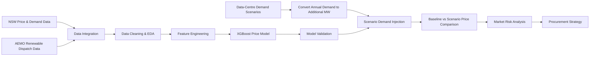
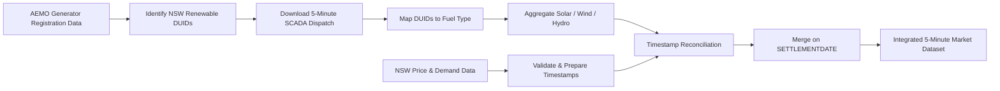

# NSW Data Centre Demand & Electricity Price Impact Analysis

## Project Overview

This project analyses how future growth in **NSW data-centre electricity demand** could affect wholesale electricity prices and market risk.

The analysis combines **5-minute NSW electricity-market data** from July 2021 to June 2024 with solar, wind and hydro dispatch data. After integrating and validating multiple data sources, the dataset was enriched with temporal, renewable-output and system-stress features to examine the conditions associated with elevated electricity prices.

Future data-centre demand scenarios were then converted into additional continuous MW load and injected into NSW demand. An **XGBoost regression model** was used to compare baseline and scenario prices and estimate the marginal price impact of additional data-centre load.

The analysis evaluates how these impacts vary across:

* demand-growth scenarios;
* seasons;
* hours of day;
* renewable-output conditions;
* system-stress periods;
* upper-tail / high-risk price intervals.

The resulting insights provide a basis for understanding **electricity-market exposure, procurement risk and potential risk-management strategies** for large data-centre loads.

---

## Business Problem

Data centres are large, energy-intensive facilities that operate close to continuously. Unlike many commercial loads, their electricity demand remains relatively stable throughout the day, meaning rapid data-centre expansion can increase the underlying **baseload demand** placed on the electricity system.

For NSW, this raises an important market question:

> **How much additional wholesale electricity-price pressure could future data-centre growth create, and under which market conditions is that impact greatest?**

The challenge is not only to estimate an average price increase. Wholesale electricity prices are highly variable and depend on the interaction between:

* system demand;
* renewable-generation availability;
* time of day;
* seasonal conditions;
* periods of system stress.

A meaningful analysis therefore needs to identify both the **typical price impact** of additional data-centre demand and the **higher-risk intervals** where the market is more sensitive to additional load.

This project addresses that problem by combining market data, renewable-generation data, scenario modelling and predictive analytics to quantify how additional data-centre demand may affect NSW wholesale prices and translate those results into practical market-risk insights.


### Baseline vs Scenario Comparison

The model does **not** compare future prices against FY2025 prices directly.

Instead, it compares two predictions generated from the same historical 5-minute market conditions:

```text
Baseline Predicted Price
= Modelled price using the original historical NSW demand profile

Scenario Predicted Price
= Modelled price after adding future data-centre demand to NSW demand
```

The estimated price impact is then calculated as:

```text
Price Impact
= Scenario Predicted Price − Baseline Predicted Price
```

For example, if a particular historical interval has:

```text
Baseline predicted price = $120/MWh
Scenario predicted price = $138/MWh
```

then:

```text
Price impact = $18/MWh
```

FY2025 is used only as the **reference point for calculating additional data-centre demand**. It is not the baseline price year.

This approach isolates the marginal effect of additional data-centre load by holding the underlying historical market conditions constant and changing only the demand-related scenario inputs.

## Analytical Workflow

The analysis follows an end-to-end workflow from **raw electricity-market data integration** through to **scenario-based price-impact and market-risk analysis**.



### Workflow Summary

1. **Data Integration**
   Combined 5-minute NSW wholesale price and demand data with AEMO solar, wind and hydro dispatch data, including timestamp reconciliation across sources.

2. **Data Cleaning & Exploratory Analysis**
   Validated temporal completeness, cleaned renewable-dispatch values and analysed price, demand, renewable-generation, seasonal and time-of-day patterns.

3. **Feature Engineering**
   Created temporal, net-demand and system-stress features to represent market conditions associated with elevated electricity prices.

4. **Price Modelling & Validation**
   Developed an XGBoost regression model and evaluated alternative price-cap settings using MAE, RMSE, R² and sensitivity testing.

5. **Scenario Demand Injection**
   Converted future annual data-centre demand projections into additional continuous MW and added this load to the historical NSW demand profile.

6. **Baseline vs Scenario Comparison**
   Generated prices under the original demand profile and under each additional-demand scenario, with the difference representing the estimated marginal price impact.

7. **Market Risk Analysis**
   Evaluated price impacts across growth scenarios, seasons, hours of day, renewable-output conditions, system-stress periods and upper-tail risk intervals.

8. **Procurement Strategy**
   Translated the resulting price-risk patterns into implications for electricity procurement, hedging and flexible demand management.

## Data Sources & Integration

The modelling dataset was created by combining **NSW wholesale price and demand data** with **5-minute renewable-generation dispatch data** for solar, wind and hydro.

### Data Integration Workflow



### Integration Steps

* **Generator identification**
  AEMO's **Generators and Scheduled Loads** registration data was retrieved using NEMOSIS and filtered to generators located in the `NSW1` region with **solar, wind or hydro** fuel sources.

* **Renewable dispatch extraction**
  The identified generator DUIDs were used to download `DISPATCH_UNIT_SCADA` observations at **5-minute resolution** for **July 2021 to June 2024**. The required fields were `SETTLEMENTDATE`, `DUID` and `SCADAVALUE`.

* **Fuel-type mapping and aggregation**
  Each DUID was mapped to its fuel source. Dispatch values were then aggregated by **settlement timestamp and fuel type** and pivoted into:

  * `solar_dispatch`
  * `wind_dispatch`
  * `hydro_dispatch`

* **Price and demand preparation**
  NSW wholesale price and demand data was loaded separately and prepared at the same 5-minute temporal grain.

* **Timestamp reconciliation**
  A one-second timestamp mismatch was identified between the datasets: price/demand records were stored at times such as `00:04:59`, while SCADA records used `00:05:00`.
  **One second was added to the price/demand timestamps** so equivalent market intervals aligned correctly.

* **Merge validation**
  Timestamp overlap was checked after reconciliation to confirm that the two datasets aligned as expected before the final join.

* **Final integration**
  The datasets were merged on `SETTLEMENTDATE`, producing a single 5-minute analytical dataset containing:

  `NSW1_Price` • `NSW1_Demand` • `solar_dispatch` • `wind_dispatch` • `hydro_dispatch`

This integrated dataset became the input for subsequent **data cleaning, exploratory analysis, feature engineering and price-impact modelling**.

## Data Cleaning & Pre-Modelling Analysis

Before model training, the integrated 5-minute dataset was cleaned and explored to understand the market conditions associated with NSW wholesale-price movements and identify suitable modelling features.

### Data Cleaning & Preparation

The dataset was validated for temporal completeness and consistency before analysis. Key preparation steps included:

* checking date coverage, missing and duplicate timestamps;
* validating the expected **5-minute interval structure**;
* removing observations with incomplete renewable-dispatch data;
* clipping negative aggregated renewable dispatch values to zero;
* retaining complete days with **288 five-minute intervals**;
* deriving temporal features including `Hour`, `DayOfWeek`, `Month`, `Season`, `Year` and `DayType`.

These steps created a consistent time-series dataset for subsequent exploratory analysis and modelling.

---

### Exploratory Market Analysis

Price, demand and renewable-generation behaviour were examined using descriptive statistics, distribution analysis, correlations, quantiles and time-based comparisons.

Key findings were:

* **Wholesale prices were highly right-skewed**, with a relatively small number of extreme intervals materially increasing the mean above the median.
* **Higher demand was generally associated with higher prices**, particularly in the upper demand quartiles, but demand-price correlation was only moderate, indicating that demand alone could not explain price spikes.
* **Solar dispatch was negatively associated with price**, with prices increasing as solar output declined during the evening.
* **Hydro dispatch increased during high-price periods**, consistent with its role as a dispatchable balancing source.
* Price pressure varied materially by **hour, month and season**, with elevated baseline prices concentrated around evening peaks and autumn/winter conditions.


### System-Stress Analysis

EDA showed that the highest-price conditions were associated with **combinations of market pressures**, rather than any single variable.

To capture these interactions, several stress indicators were created:

| Feature                  | Definition                                  |
| ------------------------ | ------------------------------------------- |
| `DemandStressFlag`       | Demand above the historical 75th percentile |
| `CoreSystemStressFlag`   | High demand + low solar + evening peak      |
| `SevereSystemStressFlag` | Core system stress + autumn/winter          |

Price levels increased as market conditions became progressively tighter:

**High Demand → High Demand + Low Solar + Evening Peak → Seasonal System Stress**

This confirmed that wholesale-price risk is highly conditional and concentrated in periods where **demand pressure, reduced renewable availability and timing effects overlap**.


### Feature Screening & Modelling Implications

Candidate predictors were screened using:

* Pearson and Spearman correlation analysis;
* correlation-matrix inspection;
* Variance Inflation Factor (VIF) for multicollinearity;
* categorical encoding for seasonal and day-type variables;
* a chronological train/test split to preserve the time-series structure.

The pre-modelling analysis indicated that a simple demand-price regression would be insufficient. The downstream model therefore needed to capture:

* electricity demand;
* solar, wind and hydro dispatch;
* net-demand conditions;
* hour and seasonal effects;
* day type;
* system-stress interactions.

These findings supported the use of a **nonlinear modelling approach** capable of representing interactions between demand, renewable availability and market conditions.


