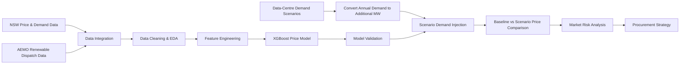
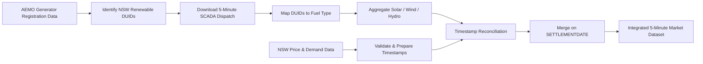

# NSW Data Centre Demand & Electricity Price Impact Analysis

## Project Overview

This project analyses how future growth in **NSW data-centre electricity demand** could affect wholesale electricity prices and market risk.

The analysis combines **5-minute NSW electricity-market data** from July 2021 to June 2024 with solar, wind and hydro dispatch data. After integrating and validating multiple data sources, the dataset was enriched with temporal, renewable-output and system-stress features to examine the conditions associated with elevated electricity prices.

Future data-centre demand scenarios were then converted into additional continuous MW load and injected into NSW demand. An **XGBoost regression model** was used to compare baseline and scenario prices and estimate the marginal price impact of additional data-centre load.

The analysis evaluates how these impacts vary across:

* demand-growth scenarios;
* seasons;
* hours of day;
* renewable-output conditions;
* system-stress periods;
* upper-tail / high-risk price intervals.

The resulting insights provide a basis for understanding **electricity-market exposure, procurement risk and potential risk-management strategies** for large data-centre loads.

---

## Business Problem

Data centres are large, energy-intensive facilities that operate close to continuously. Unlike many commercial loads, their electricity demand remains relatively stable throughout the day, meaning rapid data-centre expansion can increase the underlying **baseload demand** placed on the electricity system.

For NSW, this raises an important market question:

> **How much additional wholesale electricity-price pressure could future data-centre growth create, and under which market conditions is that impact greatest?**

The challenge is not only to estimate an average price increase. Wholesale electricity prices are highly variable and depend on the interaction between:

* system demand;
* renewable-generation availability;
* time of day;
* seasonal conditions;
* periods of system stress.

A meaningful analysis therefore needs to identify both the **typical price impact** of additional data-centre demand and the **higher-risk intervals** where the market is more sensitive to additional load.

This project addresses that problem by combining market data, renewable-generation data, scenario modelling and predictive analytics to quantify how additional data-centre demand may affect NSW wholesale prices and translate those results into practical market-risk insights.

## Analytical Workflow

The analysis follows an end-to-end workflow from **raw electricity-market data integration** through to **scenario-based price-impact and market-risk analysis**.



### Workflow Summary

1. **Data Integration**
   Combined 5-minute NSW wholesale price and demand data with AEMO solar, wind and hydro dispatch data, including timestamp reconciliation across sources.

2. **Data Cleaning & Exploratory Analysis**
   Validated temporal completeness, cleaned renewable-dispatch values and analysed price, demand, renewable-generation, seasonal and time-of-day patterns.

3. **Feature Engineering**
   Created temporal, net-demand and system-stress features to represent market conditions associated with elevated electricity prices.

4. **Price Modelling & Validation**
   Developed an XGBoost regression model and evaluated alternative price-cap settings using MAE, RMSE, R² and sensitivity testing.

5. **Scenario Demand Injection**
   Converted future annual data-centre demand projections into additional continuous MW and added this load to the historical NSW demand profile.

6. **Baseline vs Scenario Comparison**
   Generated prices under the original demand profile and under each additional-demand scenario, with the difference representing the estimated marginal price impact.

7. **Market Risk Analysis**
   Evaluated price impacts across growth scenarios, seasons, hours of day, renewable-output conditions, system-stress periods and upper-tail risk intervals.

8. **Procurement Strategy**
   Translated the resulting price-risk patterns into implications for electricity procurement, hedging and flexible demand management.

## Data Sources & Integration

The modelling dataset was created by combining **NSW wholesale price and demand data** with **5-minute renewable-generation dispatch data** for solar, wind and hydro.

### Data Integration Workflow



### Integration Steps

* **Generator identification**
  AEMO's **Generators and Scheduled Loads** registration data was retrieved using NEMOSIS and filtered to generators located in the `NSW1` region with **solar, wind or hydro** fuel sources.

* **Renewable dispatch extraction**
  The identified generator DUIDs were used to download `DISPATCH_UNIT_SCADA` observations at **5-minute resolution** for **July 2021 to June 2024**. The required fields were `SETTLEMENTDATE`, `DUID` and `SCADAVALUE`.

* **Fuel-type mapping and aggregation**
  Each DUID was mapped to its fuel source. Dispatch values were then aggregated by **settlement timestamp and fuel type** and pivoted into:

  * `solar_dispatch`
  * `wind_dispatch`
  * `hydro_dispatch`

* **Price and demand preparation**
  NSW wholesale price and demand data was loaded separately and prepared at the same 5-minute temporal grain.

* **Timestamp reconciliation**
  A one-second timestamp mismatch was identified between the datasets: price/demand records were stored at times such as `00:04:59`, while SCADA records used `00:05:00`.
  **One second was added to the price/demand timestamps** so equivalent market intervals aligned correctly.

* **Merge validation**
  Timestamp overlap was checked after reconciliation to confirm that the two datasets aligned as expected before the final join.

* **Final integration**
  The datasets were merged on `SETTLEMENTDATE`, producing a single 5-minute analytical dataset containing:

  `NSW1_Price` • `NSW1_Demand` • `solar_dispatch` • `wind_dispatch` • `hydro_dispatch`

This integrated dataset became the input for subsequent **data cleaning, exploratory analysis, feature engineering and price-impact modelling**.

## Data Cleaning & Pre-Modelling Analysis

Before model training, the integrated 5-minute dataset was cleaned and explored to understand the market conditions associated with NSW wholesale-price movements and identify suitable modelling features.

### Data Cleaning & Preparation

The dataset was validated for temporal completeness and consistency before analysis. Key preparation steps included:

* checking date coverage, missing and duplicate timestamps;
* validating the expected **5-minute interval structure**;
* removing observations with incomplete renewable-dispatch data;
* clipping negative aggregated renewable dispatch values to zero;
* retaining complete days with **288 five-minute intervals**;
* deriving temporal features including `Hour`, `DayOfWeek`, `Month`, `Season`, `Year` and `DayType`.

These steps created a consistent time-series dataset for subsequent exploratory analysis and modelling.

---

### Exploratory Market Analysis

Price, demand and renewable-generation behaviour were examined using descriptive statistics, distribution analysis, correlations, quantiles and time-based comparisons.

Key findings were:

* **Wholesale prices were highly right-skewed**, with a relatively small number of extreme intervals materially increasing the mean above the median.
* **Higher demand was generally associated with higher prices**, particularly in the upper demand quartiles, but demand-price correlation was only moderate, indicating that demand alone could not explain price spikes.
* **Solar dispatch was negatively associated with price**, with prices increasing as solar output declined during the evening.
* **Hydro dispatch increased during high-price periods**, consistent with its role as a dispatchable balancing source.
* Price pressure varied materially by **hour, month and season**, with elevated baseline prices concentrated around evening peaks and autumn/winter conditions.


### System-Stress Analysis

EDA showed that the highest-price conditions were associated with **combinations of market pressures**, rather than any single variable.

To capture these interactions, several stress indicators were created:

| Feature                  | Definition                                  |
| ------------------------ | ------------------------------------------- |
| `DemandStressFlag`       | Demand above the historical 75th percentile |
| `CoreSystemStressFlag`   | High demand + low solar + evening peak      |
| `SevereSystemStressFlag` | Core system stress + autumn/winter          |

Price levels increased as market conditions became progressively tighter:

**High Demand → High Demand + Low Solar + Evening Peak → Seasonal System Stress**

This confirmed that wholesale-price risk is highly conditional and concentrated in periods where **demand pressure, reduced renewable availability and timing effects overlap**.


### Feature Screening & Modelling Implications

Candidate predictors were screened using:

* Pearson and Spearman correlation analysis;
* correlation-matrix inspection;
* Variance Inflation Factor (VIF) for multicollinearity;
* categorical encoding for seasonal and day-type variables;
* a chronological train/test split to preserve the time-series structure.

The pre-modelling analysis indicated that a simple demand-price regression would be insufficient. The downstream model therefore needed to capture:

* electricity demand;
* solar, wind and hydro dispatch;
* net-demand conditions;
* hour and seasonal effects;
* day type;
* system-stress interactions.

These findings supported the use of a **nonlinear modelling approach** capable of representing interactions between demand, renewable availability and market conditions.


## Scenario Demand Modelling

Future NSW data-centre electricity demand was represented using three growth scenarios: **Slower Growth, Step Change and Accelerated Transition**. The purpose was to translate annual demand projections into additional continuous MW that could be introduced into the historical NSW market dataset.

### Scenario Inputs

FY2025 data-centre electricity demand of **2.6 TWh** was used as the reference baseline. Only the incremental demand above this level was introduced into the price-impact analysis.

| Scenario               | FY2030 Data-Centre Demand |
| ---------------------- | ------------------------: |
| Slower Growth          |                   4.9 TWh |
| Step Change            |                   8.2 TWh |
| Accelerated Transition |                  13.3 TWh |

The three scenarios represent progressively higher levels of future data-centre growth and therefore increasingly large additions to NSW electricity demand.

---

### Converting Annual Demand to MW

The scenario inputs were originally expressed as annual electricity consumption in TWh/GWh, while `NSW1_Demand` is measured in MW at each 5-minute interval.

Annual electricity demand was therefore converted into an equivalent continuous MW load using:

```text
Average MW = Annual GWh × 1,000 / 8,760
```

Additional demand above the FY2025 reference level was then calculated as:

```text
Additional MW = Future Scenario MW − FY2025 Baseline MW
```

This conversion made the scenario inputs compatible with the interval-level NSW demand data used by the price model.

---

### Additional Data-Centre Demand

The resulting additional demand increased progressively across both time and scenario intensity.

| Financial Year | Slower Growth | Step Change | Accelerated Transition |
| -------------- | ------------: | ----------: | ---------------------: |
| FY2026         |      45.66 MW |    79.91 MW |              114.16 MW |
| FY2027         |      91.32 MW |   182.65 MW |              273.97 MW |
| FY2028         |     136.99 MW |   296.80 MW |              502.28 MW |
| FY2029         |     194.06 MW |   445.21 MW |              799.09 MW |
| FY2030         |     262.56 MW |   639.27 MW |            1,221.46 MW |

By FY2030, the central **Step Change** scenario adds approximately **639 MW** of continuous demand, while the **Accelerated Transition** scenario adds more than **1.2 GW**.


### Scenario Demand Injection

For each scenario-year combination, additional data-centre demand was added directly to the original historical NSW demand profile:

```text
Scenario NSW Demand =
Historical NSW1_Demand + Additional Data-Centre MW
```

The additional MW was applied consistently across all 5-minute intervals, reflecting the near-continuous baseload characteristics of large data-centre operations.

After demand injection:

* `NSW1_Demand` was updated;
* `Net_Demand` was recalculated;
* demand-stress indicators were recalculated;
* renewable dispatch was held constant;
* all scenario-dependent features were updated before price prediction.

Holding renewable dispatch unchanged allowed the analysis to isolate the demand-side effect of additional data-centre load rather than introducing simultaneous assumptions about future electricity supply.

---

### Baseline vs Scenario Comparison

The model does **not** compare future prices against FY2025 prices directly.

Instead, it compares two predictions generated from the same historical 5-minute market conditions:

```text
Baseline Predicted Price
= Modelled price using the original historical NSW demand profile

Scenario Predicted Price
= Modelled price after adding future data-centre demand to NSW demand
```

The estimated price impact is then calculated as:

```text
Price Impact
= Scenario Predicted Price − Baseline Predicted Price
```

For example, if a particular historical interval has:

```text
Baseline predicted price = $120/MWh
Scenario predicted price = $138/MWh
```

then:

```text
Price impact = $18/MWh
```

FY2025 is used only as the **reference point for calculating additional data-centre demand**. It is not the baseline price year.

This approach isolates the marginal effect of additional data-centre load by holding the underlying historical market conditions constant and changing only the demand-related scenario inputs.

### Why This Matters

This framework provides a consistent way to test how increasingly large blocks of continuous data-centre demand affect NSW wholesale prices under comparable historical market conditions.

By applying the same modelling structure across all scenario-year combinations, differences in price impact can be attributed primarily to the **scale of additional data-centre demand** rather than changes in the underlying modelling framework.

## XGBoost Price Model

The price model was designed to estimate NSW wholesale electricity prices from demand, renewable generation, temporal conditions and system-stress indicators.

The objective was not to build a precise short-term forecasting system, but to create a consistent model structure for evaluating how wholesale prices respond to additional data-centre demand.

---

### Model Inputs

The final feature set reflected the market relationships identified during the pre-modelling analysis in section 5.

| Feature Group      | Example Variables                         |
| ------------------ | ----------------------------------------- |
| Demand             | `NSW1_Demand`, `Net_Demand`               |
| Renewable Dispatch | Solar, wind, hydro                        |
| Temporal           | Hour, day type, month, season             |
| Market Stress      | Demand stress, core stress, severe stress |

These variables allowed the model to capture interactions between electricity demand, renewable availability, time-of-day effects and stressed market conditions.

---

### Model Development & Selection

A linear regression model was first used as a baseline, but its performance was limited because wholesale electricity prices are highly volatile and respond nonlinearly to changing market conditions.

Tree-based models were then evaluated, with **XGBoost** selected for the final analysis because it could better capture nonlinear relationships and feature interactions.

Price-lag and rolling-price variables were also tested during model development. Although these improved predictive accuracy, they made the model less responsive to injected demand because predictions remained strongly anchored to historical prices.

For the final scenario analysis, a **lag-free XGBoost specification** was therefore selected so that the model responded more directly to changes in demand and market conditions.

---

### Price-Cap Sensitivity

NSW wholesale electricity prices contain rare extreme RRP spikes that can disproportionately influence model training and error metrics.

To reduce this distortion, alternative target-price caps were tested at:

* p99;
* p99.5;
* p99.9;
* $1,000/MWh.

| Price Cap  |       MAE |      RMSE |        R² |
| ---------- | --------: | --------: | --------: |
| **p99**    | **40.47** | **62.16** | **0.462** |
| p99.5      |     41.07 |     64.54 |     0.455 |
| p99.9      |     43.06 |     80.89 |     0.395 |
| $1,000/MWh |     42.59 |     74.73 |     0.417 |

The **p99 model** produced the strongest overall validation performance while retaining normal-to-high price behaviour and reducing the influence of rare extreme observations.

P95 price impact represents the 95th-percentile outcome — only 5% of modelled intervals experience a larger price impact. It is used here as an upper-tail / high-risk measure rather than a typical outcome.

Across alternative price caps, for **Step Change FY2030**, the mean impact remains around $19–20/MWh and the P95 impact around $49–52/MWh, showing that both typical and upper-tail scenario results are stable and supporting p99 as a robust base specification.


---

### Selected Model

The final model used for scenario analysis was:

```text
Lag-Free p99-Capped XGBoost Regressor
```

with validation performance of:

| Metric | Result |
| ------ | -----: |
| MAE    |  40.47 |
| RMSE   |  62.16 |
| R²     |  0.462 |

The model is therefore interpreted as a **scenario-impact model rather than a precise electricity-price forecasting tool**.

Its purpose is to provide a consistent framework for comparing how predicted wholesale prices change under different levels of additional data-centre demand.

---

### Modelling Rationale

The final specification was selected because it balanced three requirements:

* **Nonlinearity** — electricity prices respond differently under normal and stressed market conditions.
* **Scenario responsiveness** — removing price-lag variables allowed injected demand to influence predictions more directly.
* **Robustness** — p99 capping reduced distortion from rare extreme spikes while preserving the broader structure of elevated-price behaviour.

This combination made the model suitable for analysing **relative price impacts across demand-growth scenarios, seasons, hours and system-stress conditions**.
